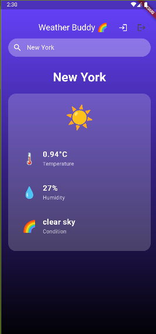

# Weather App (Flutter)

## Description
A weather application built using Flutter that provides real-time weather information. It integrates with REST APIs to fetch weather data and utilizes Firebase for data storage and authentication. Users can view weather forecasts and get updates for their location.

## Features
- Real-time weather updates using REST APIs
- Firebase authentication for user login
- User-friendly interface with weather details like temperature, humidity, wind speed, and more
- Location-based weather updates

## Tech Stack
- **Flutter** for cross-platform mobile app development
- **REST APIs** for fetching weather data
- **Firebase** for authentication and cloud storage
- **Google Maps API** for location services

## Demo



## Installation

1. Clone the repository:
   ```bash
   git clone https://github.com/yourusername/weather-app.git

1. Navigate to the project folder:
   ```bash
   cd weather-app
   ```

2. Install dependencies:
   ```bash
   flutter pub get
   ```

3. Run the app:
   ```bash
   flutter run
   ```

## Contributing
Feel free to fork this repository and submit issues or pull requests. Contributions are welcome!

## License
This project is licensed under the MIT License - see the [LICENSE](LICENSE) file for details.
